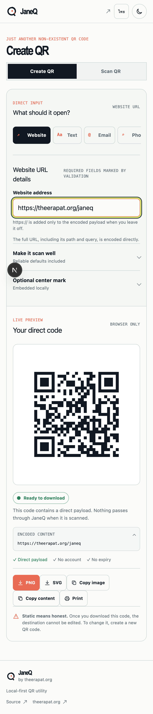
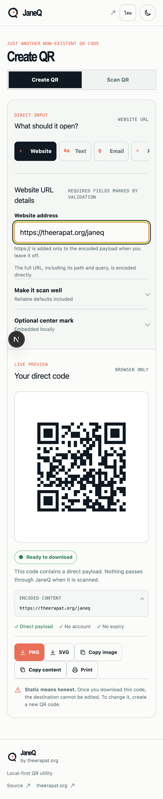

# JaneQ

> Just Another Non-Existent QR Code.

JaneQ is a small open-source QR utility by [theerapat.org](https://theerapat.org). It makes direct, static QR codes in the browser. There are no ads, tracking redirects, accounts, subscriptions, expiring links, or server-side QR content storage.

## What it supports

- Website URLs
- Plain text, including Unicode and Thai text
- English/Thai interface with a saved local language preference
- Email links with optional subject and message
- Phone numbers
- SMS messages
- Wi-Fi credentials using the common `WIFI:` format
- Contact cards using `MECARD:`
- Geographic locations using `geo:` links
- Thai PromptPay payment-request QR codes with optional amounts

The generator supports PNG and true-vector SVG downloads, copy-to-clipboard where the browser allows it, printing, transparent backgrounds, correction levels, quiet-zone size, output size, square or rounded modules, and a local center mark or uploaded logo.

## Privacy model

QR matrices are generated in the browser with the open-source [`qrcode`](https://github.com/soldair/node-qrcode) library. PromptPay payloads are generated locally with [`promptpay-qr`](https://github.com/dtinth/promptpay-qr). Entered content and uploaded logos are not sent to JaneQ, stored in a database, or passed through a redirect URL. There is no analytics SDK or application backend in this repository.

This is a statement about the generator. Review every destination before publishing it: JaneQ cannot verify whether an encoded URL or message is safe.

## Static-code limitation

JaneQ creates static QR codes. The destination is encoded inside the downloaded image, so the file works independently of JaneQ and does not expire. It also means the destination cannot be edited after download; to change it, create a new QR code.

## Local setup

Requirements: Node.js 20+ and npm.

```bash
npm ci
npm run dev
```

Open [http://localhost:3000](http://localhost:3000).

## Validation commands

```bash
npm run typecheck
npm run lint
npm test
npm run test:e2e
npm run build
```

`npm run build` uses Next.js static export and writes the deployable site to `out/`.

## Deployment

JaneQ has no runtime secrets or persistent service. The static output can be deployed to:

- **Cloudflare Pages:** build command `npm run build`, output directory `out`, Node version 20.
- **Vercel:** import the repository; the `output: "export"` setting in `next.config.mjs` produces a static deployment.
- **GitHub Pages:** publish the contents of `out/` from a workflow or static-hosting action. Use a custom domain or configure `basePath`/`assetPrefix` if the project is served under a repository subpath.

The canonical URL in `app/layout.tsx`, `app/robots.ts`, and `app/sitemap.ts` is currently `https://janeq.theerapat.org`; update it before deploying to a different host.

## Architecture

```text
app/page.tsx                 marketing shell, trust story, structured data
components/qr-studio.tsx     browser-only generator workspace and exports
lib/qr.ts                    payloads, validation, matrix and render helpers
app/globals.css              semantic tokens, responsive layout, dark mode
tests/qr.test.ts             payload and reliability unit tests
tests/e2e/janeq.spec.ts      Playwright interaction coverage
```

The initial version intentionally does not include Firebase, Supabase, authentication, payments, or a database.

## Design and documentation

- [Design brief](.design/janeq/DESIGN_BRIEF.md)
- [Information architecture](.design/janeq/INFORMATION_ARCHITECTURE.md)
- [Design tokens](.design/janeq/DESIGN_TOKENS.md)
- [Accessibility checklist](ACCESSIBILITY.md)
- [Security review notes](SECURITY.md)
- [Future roadmap](ROADMAP.md)

## Example screenshots





The repository also includes a dark-mode capture at [`docs/screenshots/janeq-dark.png`](docs/screenshots/janeq-dark.png).

## License

MIT. See [LICENSE](LICENSE) when the project is published.
